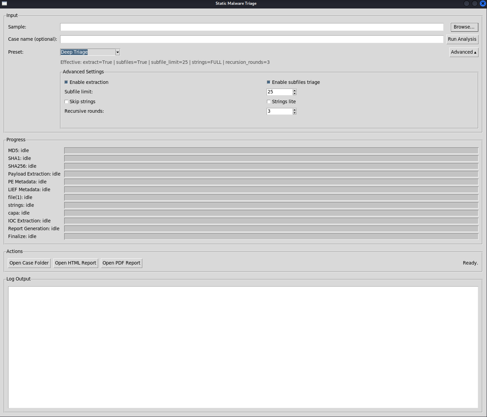
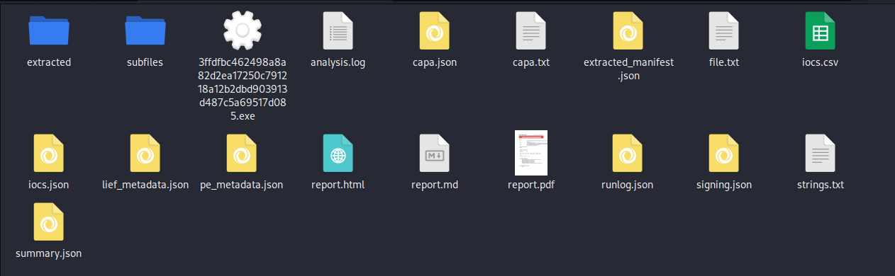
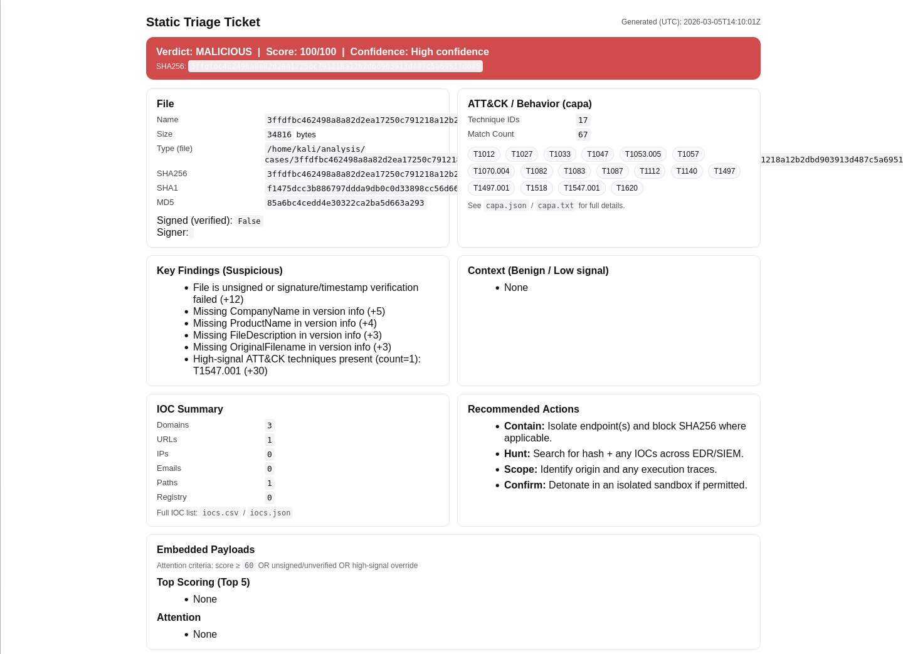
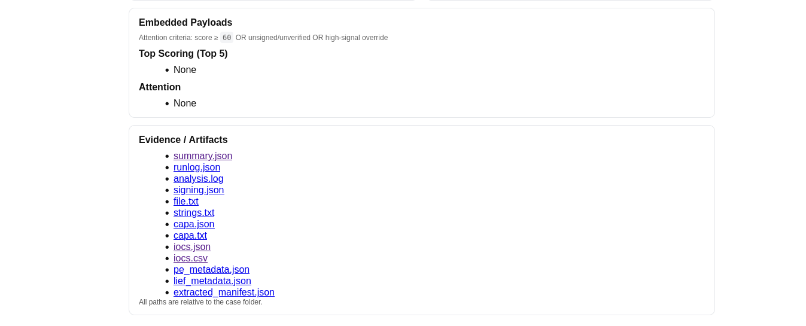
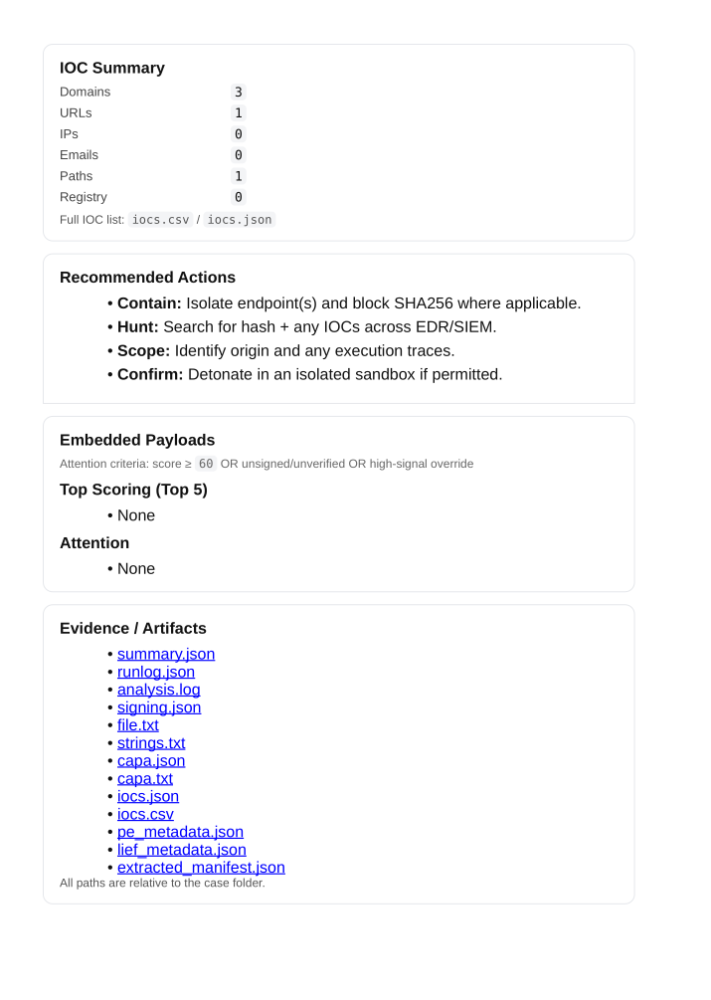

# Static Software / Malware Analysis — Static Triage Pipeline

A static triage pipeline for Windows executables and installers (EXE/DLL/MSI/CAB/ZIP/7z/Inno Setup) that produces SOC-style reports and structured case artifacts for investigation and training.

> ## ⚠️ Safety / Isolation Required
> **Do NOT run unknown malware on your personal computer or on a production network.**
>
> Use an **isolated analysis environment**:
> - A dedicated **Windows/Linux VM** (VirtualBox/VMware/Hyper‑V), or **WSL Ubuntu** inside a Windows host *that is itself treated as an analysis machine*.
> - Prefer a VM with **no shared credentials**, **no sensitive files**, and **no access to corporate networks**.
> - Use **snapshots** so you can roll back after testing.
>
> This project also uses a **Python virtual environment (`.venv`)** so dependencies/tools install locally to the project and don’t pollute your system Python.

---

## What it does

Given a Windows executable/installer, the pipeline creates a case folder and generates:

- Hashes: **MD5 / SHA1 / SHA256**
- File identification (`file.txt`)
- Strings extraction (`strings.txt`) with optional **lite mode**
- **capa** capability analysis (`capa.json`, `capa.txt`)
- PE metadata (`pe_metadata.json`) + LIEF metadata (`lief_metadata.json`)
- IOC extraction (`iocs.json`, `iocs.csv`)
- Reports: `report.md`, `report.html`, `report.pdf` (**WeasyPrint**)

### Installer payload extraction + subfile triage

- Extracts embedded payloads into `cases/<case>/extracted/`
- Supports recursive extraction (ZIP/7z/MSI/CAB; CAB fallback supported)
- Supports **Inno Setup** installers via `innoextract`
- Optional subfile triage into `cases/<case>/subfiles/<nn>_<filename>/`

---

## Repo layout

- `static_triage_engine/` — engine, steps, scoring, reporting
- `scripts/` — CLI + GUI entry points and helpers
- `tools/` — tool assets (example: capa sigs, capa rules folder)
- `docs/` — documentation assets (screenshots)
- `cases/` — **generated output** (ignored)
- `samples/` — **do not commit samples** (ignored)
- `logs/` — runtime logs (ignored)
- `.venv/` — **Python virtual environment** (ignored)

---

## Recommended environment

### Best experience: Ubuntu (native) or WSL Ubuntu
This project is most reliable on **Ubuntu** (native) or **WSL Ubuntu** on Windows.

### Windows-native
Windows-native can work, but it’s “best effort” because:
- PowerShell script execution policies can block venv activation
- Some dependencies/tools are smoother on Linux/WSL
- WeasyPrint PDF generation can be finicky on Windows

If you are new to this, use **WSL Ubuntu**.

---

## Linux / WSL setup (recommended)

### System dependencies (Ubuntu/WSL/Kali)

```bash
sudo apt update
sudo apt install -y git python3 python3-venv python3-pip \
  p7zip-full cabextract osslsigncode file binutils \
  libpango-1.0-0 libpangoft2-1.0-0 libharfbuzz0b libgdk-pixbuf-2.0-0 \
  libcairo2 libffi-dev
```

### Python virtual environment (`.venv`) (recommended and expected)

```bash
cd /path/to/Static-Software-Malware-Analysis
python3 -m venv .venv
source .venv/bin/activate
pip install -r requirements.txt
```

---

## capa setup (CLI + rules)

### 1) Install capa CLI (official FLARE package)

⚠️ **Important:** `pip install capa` may install an unrelated package. Install the official one:

```bash
pip install flare-capa
capa --version
```

### 2) Install capa rules (required)

`capa` is separate from the **rules** it uses. This repo does **not** vendor the default rules; you must install them into:

- `tools/capa-rules/rules/`

#### Option A (Linux/WSL): bootstrap script (recommended)
If your repo includes `scripts/bootstrap_capa_rules.sh`:

```bash
bash scripts/bootstrap_capa_rules.sh
# optional: pin a different tag
CAPA_RULES_TAG=v9.3.1 bash scripts/bootstrap_capa_rules.sh
```

#### Option B (Windows or manual): download rules release + extract
1) Download the official capa rules release ZIP from GitHub:
```text
https://github.com/fireeye/capa-rules/releases
```
2) Extract it and copy the `rules` folder so you end up with:
```text
<repo_root>\tools\capa-rules\rules\
```

**Quick verify (PowerShell):**
```powershell
Test-Path .\tools\capa-rules\rules
dir .\tools\capa-rules\rules | select -First 5
```

### 3) capa sigs (tracked here)
Signatures are stored in:
- `tools/capa/sigs/*.sig`

---

## Inno Setup support (recommended)

Ubuntu repo versions can lag. For best compatibility with modern Inno installers, build `innoextract` from source:

```bash
sudo apt update
sudo apt install -y git cmake g++ make libboost-all-dev libssl-dev zlib1g-dev liblzma-dev

cd /tmp
rm -rf innoextract
git clone https://github.com/dscharrer/innoextract.git
cd innoextract
cmake -S . -B build -DCMAKE_BUILD_TYPE=Release
cmake --build build -j"$(nproc)"
sudo cmake --install build

which innoextract
innoextract --version 2>/dev/null || innoextract -v 2>/dev/null
```

---

## Windows setup (PowerShell) — venv without activation (recommended)

PowerShell often blocks `Activate.ps1` with “running scripts is disabled”. To avoid that entirely, **do not activate** the venv; call its Python directly.

> **Python version note:** Many security tooling wheels lag behind new Python releases. If you hit install issues, use **Python 3.11 or 3.12**.

From your repo root:

```powershell
# 1) Create venv (first time only)
python -m venv .venv

# 2) Install deps into the venv (no activation needed)
.\.venv\Scripts\python.exe -m pip install --upgrade pip
.\.venv\Scripts\python.exe -m pip install -r requirements.txt

# 3) Install capa CLI into the venv
.\.venv\Scripts\python.exe -m pip install flare-capa
```

Verify venv Python:

```powershell
.\.venv\Scripts\python.exe -c "import sys; print(sys.executable)"
```

Verify capa location/version (in venv):

```powershell
.\.venv\Scripts\capa.exe --version
.\.venv\Scripts\python.exe -m pip show flare-capa
```

### Optional: enable activation (if you want)
If you prefer activation, you can allow it for your user:

```powershell
Set-ExecutionPolicy -Scope CurrentUser -ExecutionPolicy RemoteSigned
.\.venv\Scripts\Activate.ps1
```

---

## Windows (Release EXE) — Read this first

If you downloaded a GitHub Release ZIP and ran the **Windows EXE**, the app may launch, but **some analysis steps require external tools** (capa rules, extraction utilities, PDF deps).

Minimum for “full” results on Windows:
- `tools\capa-rules\rules\` populated (see “Install capa rules” above)
- capa installed (recommended: inside `.venv`)
- 7-Zip installed (recommended) for recursive extraction

### 7-Zip (recommended)
Install 7-Zip and add it to PATH (or ensure `7z.exe` is discoverable).

Verify:
```powershell
7z
```

### PDF output note
PDF generation uses WeasyPrint and can fail on Windows due to system library requirements.
- If PDF fails, you should still get: `report.md` and `report.html`.
- For reliable PDFs, use **WSL Ubuntu**.

---

## Running

### CLI (Linux/WSL)
```bash
source .venv/bin/activate
python3 scripts/static_triage.py /path/to/sample.exe --case MyCase --no-progress
```

Common presets:
```bash
# Fast triage
python3 scripts/static_triage.py /path/to/sample.exe --case MyCase --no-progress --strings-lite --subfile-limit 5

# Deep triage
python3 scripts/static_triage.py /path/to/sample.exe --case MyCase --no-progress --subfile-limit 25

# Hash-only (minimal)
python3 scripts/static_triage.py /path/to/sample.exe --case MyCase --no-progress --no-extract --no-subfiles --no-strings
```

### CLI (Windows PowerShell, no activation)
```powershell
.\.venv\Scripts\python.exe scripts\static_triage.py D:\path\to\sample.exe --case MyCase --no-progress
```

### GUI (Linux/WSL)
```bash
source .venv/bin/activate
python3 -m scripts.static_triage_gui
```

---

## Outputs

Each run creates:

```text
cases/<case_name>/
  summary.json
  runlog.json
  analysis.log
  signing.json
  file.txt
  strings.txt
  capa.json
  capa.txt
  pe_metadata.json
  lief_metadata.json
  iocs.json
  iocs.csv
  report.md
  report.html
  report.pdf
  extracted/                      (if extraction enabled)
  extracted_manifest.json
  subfiles/<nn>_<filename>/       (if subfile triage enabled)
```

---

## Screenshots







---

## Windows notes (paths)

If you store samples on the Windows drive and run in WSL:

- Windows path: `D:\Projects\...`
- WSL path: `/mnt/d/Projects/...`

---

## Contributing

PRs welcome. Please avoid committing:
- malware samples
- generated `cases/` output
- large binaries

---

## License

See `LICENSE`.
