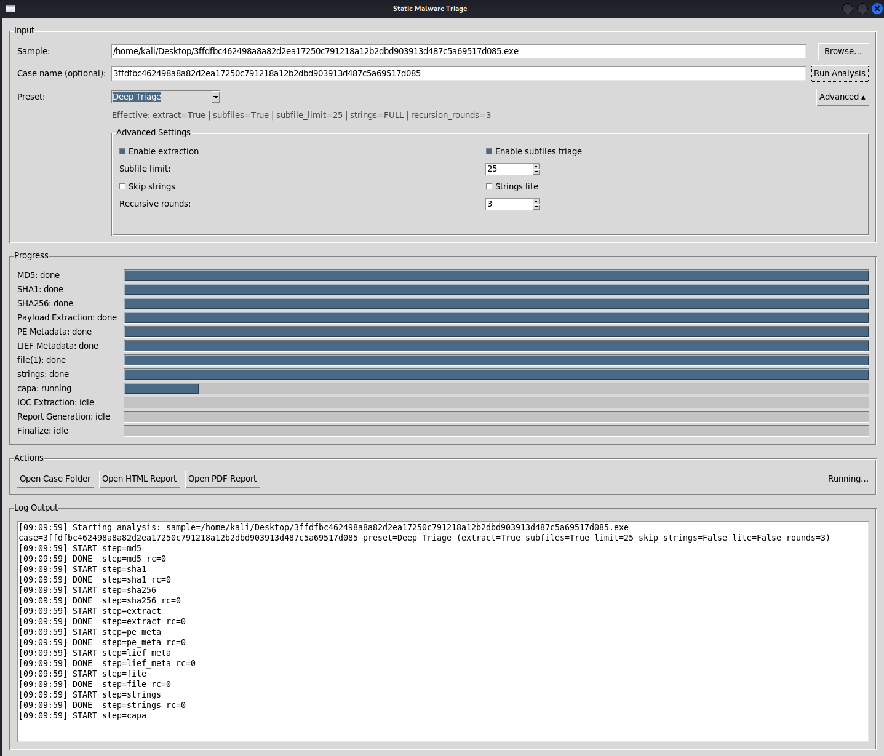
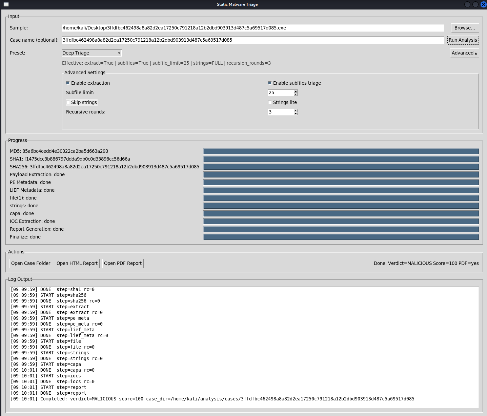
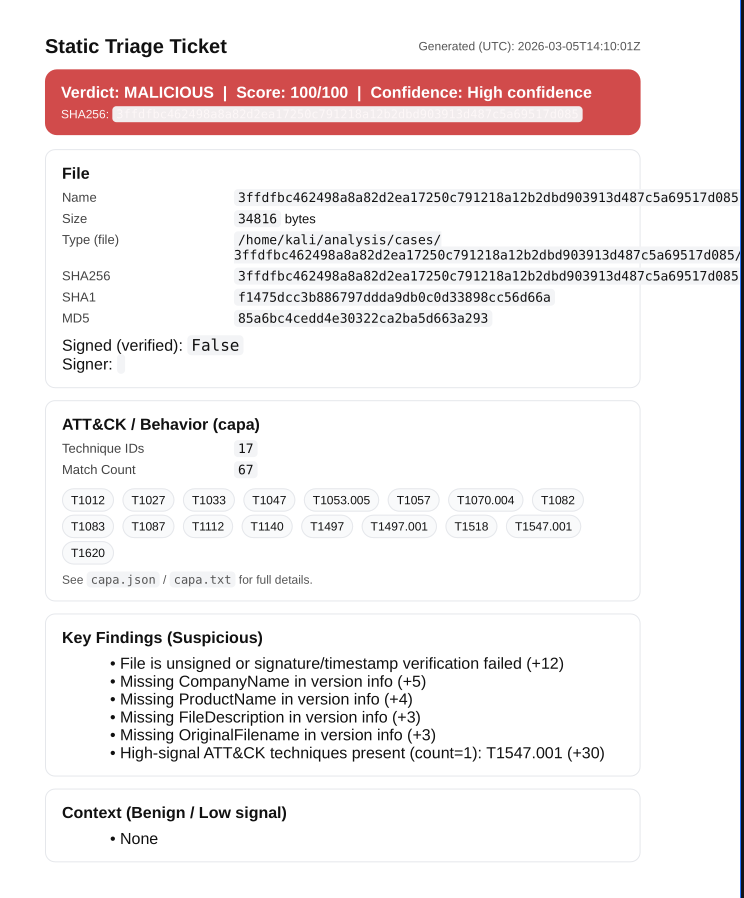

# Static Software / Malware Analysis — Static Triage Pipeline

[](LICENSE)


A static triage pipeline for Windows executables and installers (EXE/DLL/MSI/CAB/ZIP/7z/Inno Setup) that produces SOC-style reports and structured case artifacts for investigation and training.

> **Safety note:** Do not analyze unknown samples on a production host. Use an isolated VM/WSL environment and never commit samples or case outputs to Git.

---

## What it does

Given a Windows executable/installer, the pipeline creates a case folder and generates:

- Hashes: **MD5 / SHA1 / SHA256**
- `file` identification output (`file.txt`)
- Strings extraction (`strings.txt`) with **lite mode**
- **capa** capability analysis (`capa.json`, `capa.txt`)
- PE metadata (`pe_metadata.json`) + LIEF metadata (`lief_metadata.json`)
- IOC extraction (`iocs.json`, `iocs.csv`)
- Reports: `report.md`, `report.html`, `report.pdf` (**WeasyPrint**)

### Installer payload extraction + subfile triage

- Extracts embedded payloads into `cases/<case>/extracted/`
- Supports recursive extraction (ZIP/7z/MSI/CAB; CAB fallback supported)
- Supports **Inno Setup** installers via `innoextract`
- Optionally triages extracted payloads into:
  - `cases/<case>/subfiles/<nn>_<filename>/`
- Rollups include:
  - Top scoring embedded payloads
  - “Attention” list (score threshold, unsigned, high-signal indicators)

### Scoring / verdict

- Installer-aware heuristics to reduce false positives on legitimate installers
- Authenticode-aware scoring (valid signature/timestamp can lower risk unless strong indicators exist)
- Verdict output: **BENIGN / SUSPICIOUS / MALICIOUS** (heuristic triage result)

---

## Repo layout

- `static_triage_engine/` — engine, steps, scoring, reporting
- `scripts/` — CLI + GUI entry points and helpers
- `tools/` — helper assets (e.g., capa sigs)
- `docs/` — documentation assets (screenshots, notes)
- `cases/` — **generated output** (ignored)
- `samples/` — **do not commit samples** (ignored)
- `logs/` — runtime logs (ignored)
- `.venv/` — virtualenv (ignored)

---

## Requirements

### OS

Recommended: **Ubuntu** (native or **WSL Ubuntu** on Windows).  
Kali/Linux works as well. Windows-native is possible but less reliable due to tooling (WeasyPrint deps, extraction tools).

### System dependencies (Ubuntu/WSL/Kali)

```bash
sudo apt update
sudo apt install -y git python3 python3-venv python3-pip \
  p7zip-full cabextract osslsigncode file binutils \
  libpango-1.0-0 libpangoft2-1.0-0 libharfbuzz0b libgdk-pixbuf-2.0-0 \
  libcairo2 libffi-dev
```

### Python environment

```bash
cd /path/to/Static-Software-Malware-Analysis
python3 -m venv .venv
source .venv/bin/activate
pip install -r requirements.txt
```

### capa (CLI) install

⚠️ **Important:** `pip install capa` may install an unrelated package. Install the official FLARE capa CLI instead:

```bash
pip install flare-capa
capa --version
```

### LIEF

If `lief` is not installed by your requirements, install it:

```bash
pip install lief
```

---

## Inno Setup support (recommended)

Ubuntu repo versions can lag. For best compatibility with modern Inno installers, build `innoextract` from source:

```bash
sudo apt update
sudo apt install -y git cmake g++ make libboost-all-dev libssl-dev zlib1g-dev liblzma-dev

cd /tmp
rm -rf innoextract
git clone https://github.com/dscharrer/innoextract.git
cd innoextract
cmake -S . -B build -DCMAKE_BUILD_TYPE=Release
cmake --build build -j"$(nproc)"
sudo cmake --install build

which innoextract
innoextract --version 2>/dev/null || innoextract -v 2>/dev/null
```

---

## capa setup (rules + sigs)

### 1) capa rules (NOT tracked in this repo)

This repo does not vendor the default capa rule set. Download the official rules into `tools/capa-rules/`:

```bash
bash scripts/bootstrap_capa_rules.sh
# optional: pin a different tag
CAPA_RULES_TAG=v9.3.1 bash scripts/bootstrap_capa_rules.sh
```

Notes:
- The script creates `tools/capa-rules/` automatically.
- Rerun it anytime you want to update or change the pinned tag.

### 2) capa sigs (tracked here)

Signatures are stored in:
- `tools/capa/sigs/*.sig`

---

## Running

### CLI (Ubuntu/WSL/Kali)

```bash
source .venv/bin/activate
python3 scripts/static_triage.py /path/to/sample.exe --case MyCase --no-progress
```

Common presets:

```bash
# Fast triage
python3 scripts/static_triage.py /path/to/sample.exe --case MyCase --no-progress --strings-lite --subfile-limit 5

# Deep triage
python3 scripts/static_triage.py /path/to/sample.exe --case MyCase --no-progress --subfile-limit 25

# Hash-only (minimal)
python3 scripts/static_triage.py /path/to/sample.exe --case MyCase --no-progress --no-extract --no-subfiles --no-strings
```

### GUI (Ubuntu/WSL/Kali)

```bash
source .venv/bin/activate
python3 -m scripts.static_triage_gui
```

GUI includes:
- Presets dropdown (Fast / Deep / Hash Only)
- Advanced toggle (override preset values)
- Skip-strings warning (IOC extraction depends on strings output)

---

## Screenshots

### Main GUI


### While analyzing


### Finished run


### Case folder output


### HTML report


### PDF report



---

## Outputs

Each run creates:

```text
cases/<case_name>/
  summary.json
  runlog.json
  analysis.log
  signing.json
  file.txt
  strings.txt
  capa.json
  capa.txt
  pe_metadata.json
  lief_metadata.json
  iocs.json
  iocs.csv
  report.md
  report.html
  report.pdf
  extracted/                      (if extraction enabled)
  extracted_manifest.json
  subfiles/<nn>_<filename>/       (if subfile triage enabled)
```

---

## Windows notes (paths)

If you store samples on the Windows drive and run in WSL:

- Windows path: `D:\Projects\...`
- WSL path: `/mnt/d/Projects/...`

---

## Development / contributing

- Do not commit samples or `cases/` output.
- Keep large external datasets (like capa rules) out of Git.
- Prefer pinned capa rules tags for reproducible results.
- If you add new tools, document installation steps in this README.

---

## License / attribution

This project depends on third-party tooling and rule sets (e.g., capa rules/signatures, extraction utilities).  
Please follow upstream licenses for redistribution and usage.
